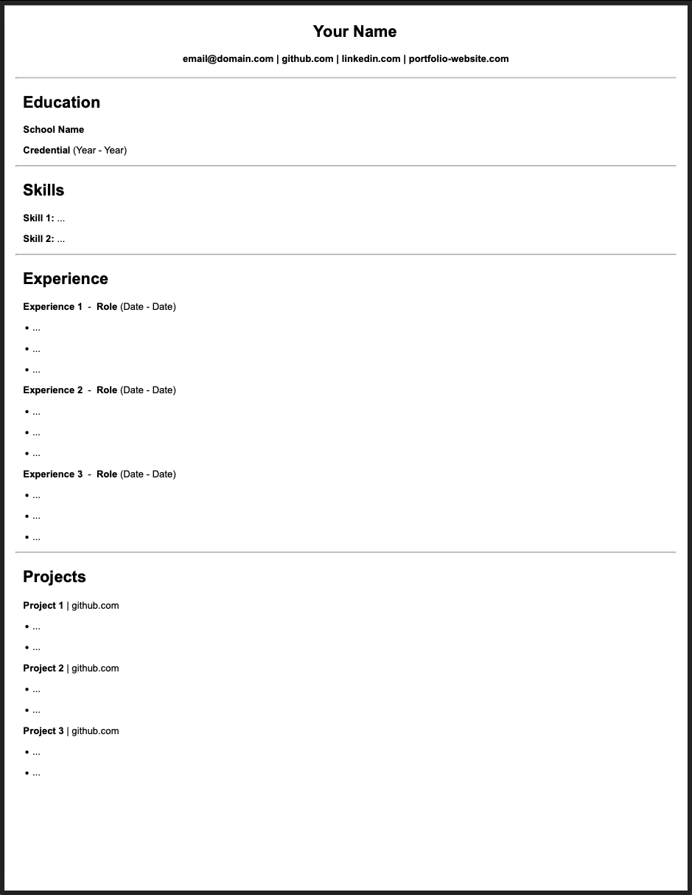

<h1 align="center">📝 Continuity</h1>

<p align="center">

</p>

<p align="center">
Create a resume using Markdown and CSS.
</p>

<p align="center">
Just fill in the template, run the script, and you'll have a simple resume in PDF format ready to go!
</p>

# Table of Contents

1. [Installation](#installation)

2. [Usage](#usage)

3. [Frequently Asked Questions](#frequently-asked-questions)

4. [Contributions](#contributions)

5. [License](#license)

# Installation 

1. Install [Node.js](https://nodejs.org/en/download)

2. Clone the repository or download the [latest release](https://github.com/alexwkleung/Continuity/releases)

```bash
git clone <SSH/HTTPS URL>
```

3. Change directory

```bash
cd <...>/Continuity
```

4. Install npm dependencies

```bash
npm install
```

5. Run the build step at least once

```bash
npm run build
# or 
make build
```

# Usage 

1. Edit `resume.md` located in the `src/client` directory. A template skeleton is already created, so you just need to fill it in.

2. If you do not like the current style/theme of the resume, you can modify `style.css` located in the `src/client/styles` directory.

3. Once you're ready to generate the PDF file, run the script below:

```bash
# generate PDF file from markdown skeleton
npm run resume
# or
make resume
```

4. The generated resume PDF (`resume.pdf`) will be located in the `src/client/output-pdf` directory.

5. If you want to preview the HTML version of the resume, you can run the following scripts to open the server. Alternatively, you can just open `resume.html` located in the `src/client/output-html` directory if you don't want to use the server. 

```bash
# run one of these scripts first
npm run resume
# or
make resume

# then run server script
npm run server
# or
make server
```

# Frequently Asked Questions

The FAQ will be updated as needed.

1. **Q:** Why does the HTML version of the resume look different?

    **A:** The HTML version may not be visually identical to the generated PDF due to formatting differences caused by the conversion done by Puppeteer.

2. **Q:** I want to use A4 instead of Letter. How do I change it?

    **A:** For those that prefer A4 size, you will need to make the following modifications:

In `create-resume.ts` (located in `src/server/util`):

CHANGE 

```typescript
//CHANGE
resumeUtil.invoke(
    'src/client/resume.md',
    'src/client/output-html/resume.html',
    'Letter', 
    'src/client/output-pdf/resume.pdf'
);
```

TO 

```typescript
//TO
resumeUtil.invoke(
    'src/client/resume.md',
    'src/client/output-html/resume.html',
    'A4', 
    'src/client/output-pdf/resume.pdf'
);
```

In `style.css` (located in `src/client/styles`):

CHANGE

```css
/* CHANGE (body) */
body { 
    background-color: white;
    /* standard US size (8.5x11 aka Letter) */
    width: 850px;
    height: 1100px;

    /* standard international size (8.27x11.7 aka A4) */
    /*
    width: 827px;
    height: 1170px;
    */
    margin: 0 auto; /* center the body */
}

/* CHANGE (hr) */
hr {
    /* optional: change border to black */
    /* 
    border-color: black; 
    */

    /* Letter */
    width: 820px;

    /* A4 */
    /*
    width: 800px; 
    */

    /* A4 alternative */
    /*
    width: 795px;
    */
}
```

TO 

```css
/* TO (body) */
body { 
    background-color: white;
    /* standard US size (8.5x11 aka Letter) */
    /*
    width: 850px;
    height: 1100px;
    */

    /* standard international size (8.27x11.7 aka A4) */
    width: 827px;
    height: 1170px;
    margin: 0 auto; /* center the body */
}

/* TO (hr) */
hr {
    /* optional: change border to black */
    /* 
    border-color: black; 
    */

    /* Letter */
    /*
    width: 820px;
    */

    /* A4 */
    width: 800px; 

    /* A4 alternative */
    /*
    width: 795px;
    */
}
```

OR TO

```css
/* TO (body) */
body { 
    background-color: white;
    /* standard US size (8.5x11 aka Letter) */
    /*
    width: 850px;
    height: 1100px;
    */

    /* standard international size (8.27x11.7 aka A4) */
    width: 827px;
    height: 1170px;
    margin: 0 auto; /* center the body */
}

/* TO (hr alternative) */
hr {
    /* optional: change border to black */
    /* 
    border-color: black; 
    */

    /* Letter */
    /*
    width: 820px;
    */

    /* A4 */
    /*
    width: 800px; 
    */

    /* A4 alternative */
    width: 795px;
}
```

3. Q: Is it recommended to modify the resume style/theme? Is it good enough to start with?

    A: Personally, I think it's a good starting template out of the box. However, I highly encourage you to modify it if you want to add your own personal touch.

# Contributions

Contributions are welcomed, but is 100% optional.

Feel free to submit a [new issue](https://github.com/alexwkleung/Continuity/issues) or a [pull request](https://github.com/alexwkleung/Continuity/pulls) if you have any improvements or concerns.

# License 

[MIT License.](https://github.com/alexwkleung/Continuity/blob/main/LICENSE)